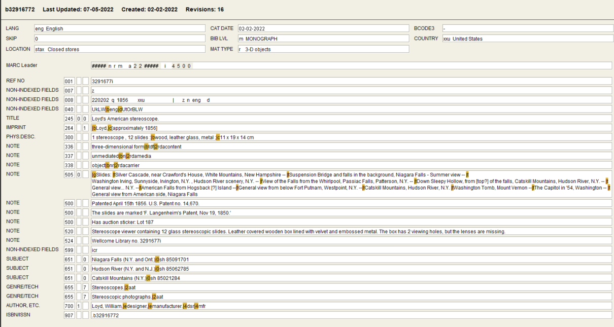

# Template

#### IDENTITY

<figure><figcaption></figcaption></figure>

#### CONTEXT

<figure><figcaption></figcaption></figure>

#### CONTENT

<figure><figcaption></figcaption></figure>

#### ACCESS

<figure><figcaption></figcaption></figure>

#### ALLIED\_MATERIALS

<figure><figcaption></figcaption></figure>
