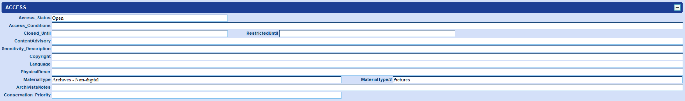

# Dealing with incorrectly merged or “hidden” catalogue records

Before assuming the catalogue record is wrong, always check to see if the website is displaying the correct one. Catalogue records are merged depending on a few variables, and sometimes this can cause problems (i.e. if 1 images is linked to 2 different bibliographic records, one gets “hidden” by mistake).

These are often spotted by the Digital Platform team, who can visualise the links between works i.e.:

Using the example above, the first bibliographic record needs to be de-linked from the second image.&#x20;

* In Sierra, search for the bibliographic number (select . SYSTEM NUMBER from the index)
* Check for the existence of image references in either/both of these MARC fields: `089` and `962`
* If the incorrect reference exists in the `089`, simply delete the field and **save** 
* If the incorrect reference exists (or also exists) in `962`, delete the link using the [Media Function](https://app.gitbook.com/o/-LumfFcEMKx4gYXKAZTQ/s/-MYL8eOUpmONV4iPo291/\~/changes/560/current-system-guidelines/sierra-marc-cataloguing/enquiries/dealing-with-online-digital-images-with-static-miro-metadata/using-the-media-function-to-delete-edit-create-image-links-in-962-field) (permissions required)
