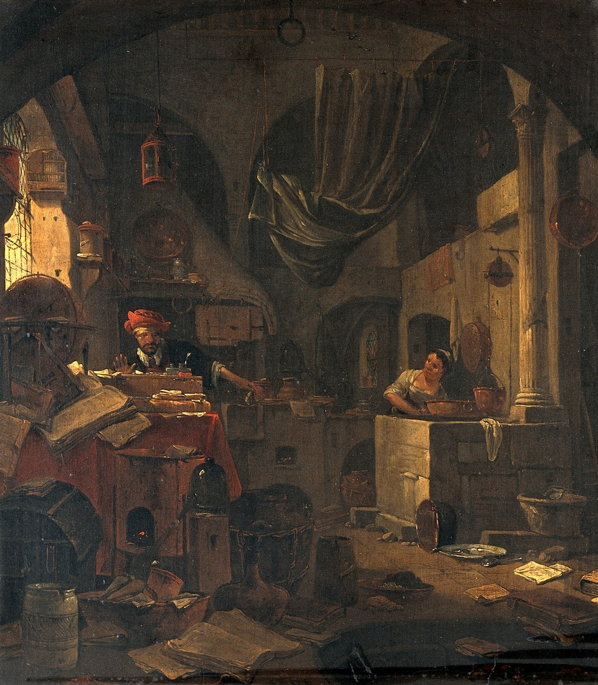

# Identifying paintings

## Watercolour

## Tips on how to recognise

* Look at the surface of the painting. Brush strokes are less clear in watercolours and the painting should have very little to no visible texture.   
* The colour of the paper underneath may affect the colour or be clear due to its translucent properties. This can give the illusion of luminosity to the painting too.  
* Look at the design of the painting. Often watercolour are used in conjunction with other techniques, particularly prints that are then coloured using watercolour. 

### Dating 



Watercolour painting is one of the oldest forms of painting being found in palaeolithic Europe cave paintings. It has been commonly use in East Asian work including Chinese, Korean and Japanese traditions and post-renaissance Europe until present.     

### Support

Watercolours are usually painted on to paper or canvas but other known supports include papyrus, bark, plastic, vellum, leather, fabric and wood.

## Tempera

## Tips on how to recognise

* If known, consider when and where the painting was made and the support. Usually tempera paintings are quite old, and most of the ones in our collection represent sacred subjects and are painted on wooden panels.   
* Look at the surface of the painting. Tempera dries very quickly, therefore it tends to have a more matte appearance and you won’t have the same brush strokes the you find in oil paintings.
* Notice the blending of colours and shapes. Because of its dry-fast properties, blending become very difficult and results in small strokes trying to approximate shadows and highlights.
* Compared to acrylic, which usually looks a bit rubbery after drying, tempera has a chalkier appearance and may crack in some places.

### Dating 



Tempera is an ancient medium and has been in constant use across the world until it was gradually superseded by oil paints in Europe, during the Renaissance. Tempera was the original mural medium in the ancient dynasties of Egypt, Babylonia, Mycenaean Greece, and China and was used to decorate the early Christian catacombs.

### Support


Generally tempera paint requires smooth supports and it was employed on stone, mummy cases, [papyrus](https://www.britannica.com/topic/papyrus-writing-material) rolls, wood [panels](https://www.britannica.com/art/panel-painting) and vellum leaves.

### General Condition/Appearance


Egg tempera is very durable and remain generally unaffected by humidity and temperature. It dries quickly to form a film which acts as protection. With tempera we can have both transparent and opaque effects, often with a satin sheen to the finish. At first glance, it could resemble the modern [acrylic](https://www.britannica.com/art/acrylic-painting) paints.

## Gouache

## Tips on how to recognise

* Look at the surface of the painting. Gouache dries very quickly, therefore it tends to have a more matte appearance with little evidence of brush strokes.  
* Notice the blending of colours and shapes. They tend to be more defined than watercolours as opaque layers can be built on top of each other with the addition of more or less water to control the intensity of the opaque effect. 
* Unlike true watercolours, the colour of the paper underneath won't affect the colour depth due to its opacity. 

### Dating 



Gouache simply describes the mixture of water, pigment and a binding agent, giving a more opaque watercolour effect with its definition changing over time. During the 18th century, gouache was used to add details to pastel drawings and by the 19th century expanded to ink and pencil drawings as well as combining with watercolour paintings. In the 20th and 21st centuries it has also been used in abstract art. 

## Oil

## Tips on how to recognise

*  If known, consider when and where the painting was made. For instance, a Flemish painting, made between 15th CE and 18th CE, it’s likely to be an oil painting.
* Look for raised brush strokes on the surface of the picture. The surface texture should be clearly visible to the naked eye, and these raised areas or undulations should correspond exactly to the colours they lie over. If possible, hold the canvas flat and take a good look along the surface
* Look for a coat of varnish, usually applied to finished oil paintings as protection and to bring out the colour of the paint. Is the image glossy? If so, it is likely to be an oil painting, as acrylic paint tends to dry more matte.
* Check the colours and its clarity and the edges. Oil paint's long drying time and tendency to blend give it softer edges.
* Keep an eye out for ‘craquelure’. Old oil paintings will show a fine pattern of spiderweb-like cracks \(watch out for artificially aged paintings!\).

### Dating 





The origins of oil painting, date to at least the 7th century CE in Bamiyan, Afghanistan. In Europe, oil as a painting medium is recorded only as early as the 11th century. The practice of easel painting with oil colours, stems directly from 15th-century tempera-painting techniques.

### Support



The standard support for oil paintings is a canvas made of linen stretched over a wooden frame. Oil paintings on wooden panels were also common during both the Middle Ages and the Renaissance. Canvas took over from panel in Italy only during the first half of the 16th century \(change led by Mantegna and the artists of Venice\). In the Netherlands this change took about a century longer, and panel paintings remained common, especially in Northern Europe.

## Acrylic 

## Tips on how to recognise

*   If known, consider the date the painting was made. If later than 1940s, there are chances it is an acrylic.
* Look at the surface of the painting. If brushstrokes and raised edges are not visible, it’s likely to be an acrylic.
* Notice the edges of the shapes on your painting. If they are crisp and sharp, it is likely to be an acrylic painting.
* The paint is often rubbery-looking.
* No primers like gesso are required, so you should be able to the paint being directly applied on the fabric of the canvas. Often a sizing is used to prevent Support Induced Discoloration \(SID\).
* Acrylic paint tends to be more vibrant in colour due to its fast-dry time.
* Look at the film of the paint. Acrylic paint tends to look more matte, although a satin \(semi-matte\) sheen is most common.

### Dating 






The synthetic paint was first used in the 1940s, combining some of the properties of oil and watercolour. Between 1946 and 1949, [Leonard Bocour](https://en.wikipedia.org/wiki/Leonard_Bocour) and [Sam Golden](https://en.wikipedia.org/wiki/Sam_Golden) invented a solution acrylic paint under the brand [Magna paint](https://en.wikipedia.org/wiki/Magna_paint). Acrylics were made available in the 1950s. They became very popular with artists when they were first commercially promoted in the 1960s. Notable 20th-century artists who used acrylic paint include Pop artists Andy Warhol and Roy Lichtenstein, Mark Rothko, and British artist David Hockney.

