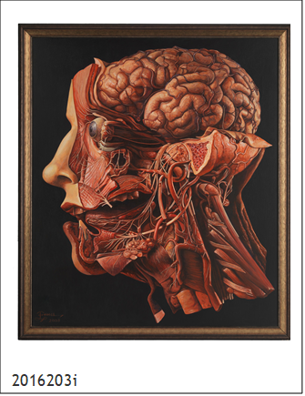

# Acrylic

## Tips on how to recognise

*   If known, consider the date the painting was made. If later than 1940s, there are chances it is an acrylic.
* Look at the surface of the painting. If brushstrokes and raised edges are not visible, it’s likely to be an acrylic.
* Notice the edges of the shapes on your painting. If they are crisp and sharp, it is likely to be an acrylic painting.
* The paint is often rubbery-looking.
* No primers like gesso are required, so you should be able to the paint being directly applied on the fabric of the canvas. Often a sizing is used to prevent Support Induced Discoloration \(SID\).
* Acrylic paint tends to be more vibrant in colour due to its fast-dry time.
* Look at the film of the paint. Acrylic paint tends to look more matte, although a satin \(semi-matte\) sheen is most common.

### Dating 






The synthetic paint was first used in the 1940s, combining some of the properties of oil and watercolour. Between 1946 and 1949, [Leonard Bocour](https://en.wikipedia.org/wiki/Leonard_Bocour) and [Sam Golden](https://en.wikipedia.org/wiki/Sam_Golden) invented a solution acrylic paint under the brand [Magna paint](https://en.wikipedia.org/wiki/Magna_paint). Acrylics were made available in the 1950s. They became very popular with artists when they were first commercially promoted in the 1960s. Notable 20th-century artists who used acrylic paint include Pop artists Andy Warhol and Roy Lichtenstein, Mark Rothko, and British artist David Hockney.

