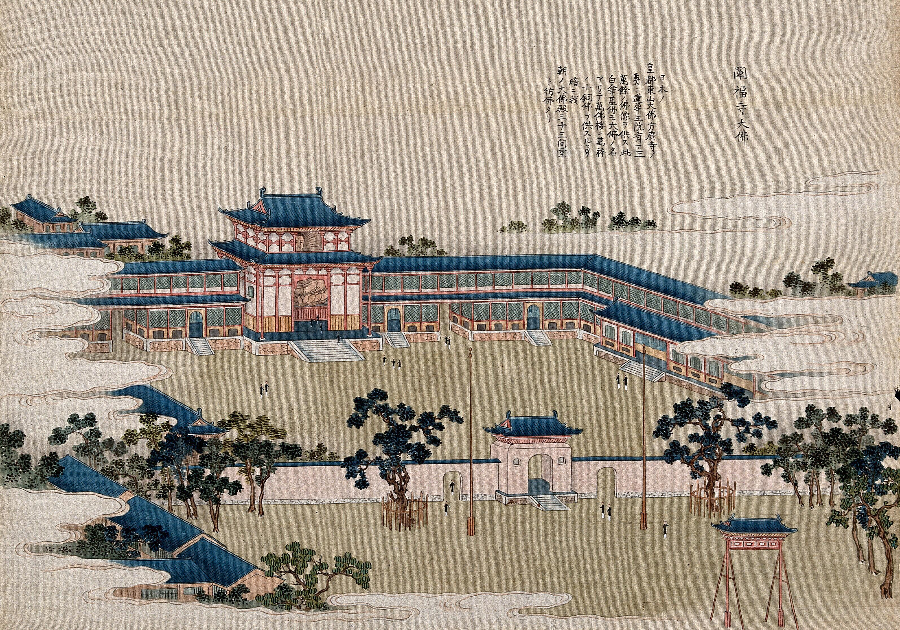

# Gouache

## Tips on how to recognise

* Look at the surface of the painting. Gouache dries very quickly, therefore it tends to have a more matte appearance with little evidence of brush strokes.  
* Notice the blending of colours and shapes. They tend to be more defined than watercolours as opaque layers can be built on top of each other with the addition of more or less water to control the intensity of the opaque effect. 
* Unlike true watercolours, the colour of the paper underneath won't affect the colour depth due to its opacity. 

### Dating 



Gouache simply describes the mixture of water, pigment and a binding agent, giving a more opaque watercolour effect with its definition changing over time. During the 18th century, gouache was used to add details to pastel drawings and by the 19th century expanded to ink and pencil drawings as well as combining with watercolour paintings. In the 20th and 21st centuries it has also been used in abstract art. 

