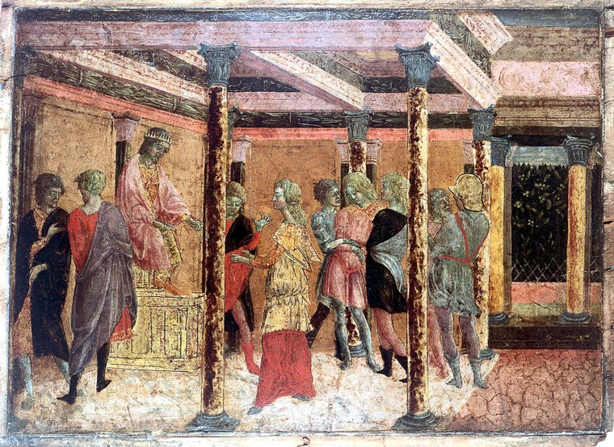

# Tempera

## Tips on how to recognise

* If known, consider when and where the painting was made and the support. Usually tempera paintings are quite old, and most of the ones in our collection represent sacred subjects and are painted on wooden panels.   
* Look at the surface of the painting. Tempera dries very quickly, therefore it tends to have a more matte appearance and you won’t have the same brush strokes the you find in oil paintings.
* Notice the blending of colours and shapes. Because of its dry-fast properties, blending become very difficult and results in small strokes trying to approximate shadows and highlights.
* Compared to acrylic, which usually looks a bit rubbery after drying, tempera has a chalkier appearance and may crack in some places.

### Dating 



Tempera is an ancient medium and has been in constant use across the world until it was gradually superseded by oil paints in Europe, during the Renaissance. Tempera was the original mural medium in the ancient dynasties of Egypt, Babylonia, Mycenaean Greece, and China and was used to decorate the early Christian catacombs.

### Support


Generally tempera paint requires smooth supports and it was employed on stone, mummy cases, [papyrus](https://www.britannica.com/topic/papyrus-writing-material) rolls, wood [panels](https://www.britannica.com/art/panel-painting) and vellum leaves.

### General Condition/Appearance


Egg tempera is very durable and remain generally unaffected by humidity and temperature. It dries quickly to form a film which acts as protection. With tempera we can have both transparent and opaque effects, often with a satin sheen to the finish. At first glance, it could resemble the modern [acrylic](https://www.britannica.com/art/acrylic-painting) paints.

