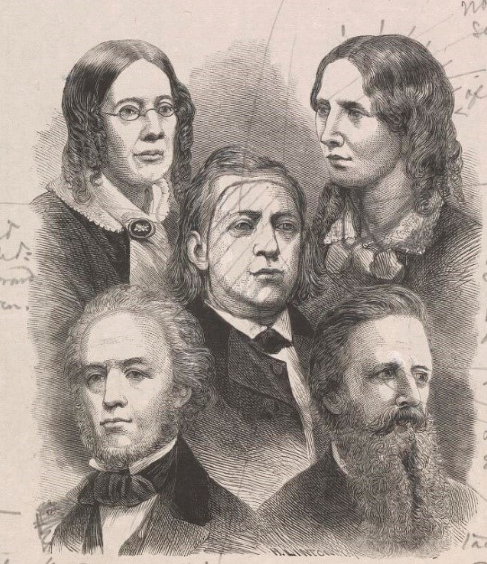
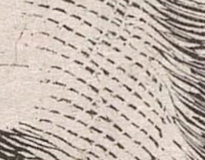
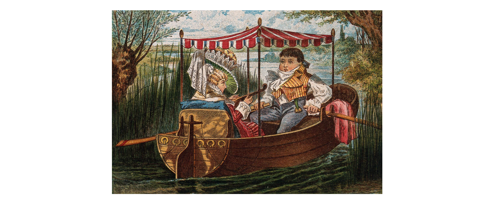
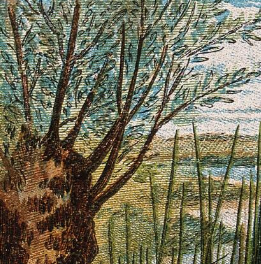

# Wood Engravings

## Tips on how to recognise

* Look at the design of the print. Fine details are possibly with wood engraving with black areas broken up by thin white lines under magnification. 

* Look at the colour of the print. If printed in black and white, larger areas of white may appear to have been scooped out. If in colour, a few colours may have been reused across the image layered on top of one another.  

### Dating 








Europe and US late 18th century

### Common subjects and themes for prints at Wellcome 

18th and 19th century prints from magazines, books, newspapers, broadsides and pamphlets 

