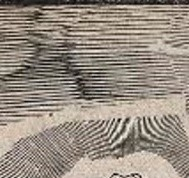
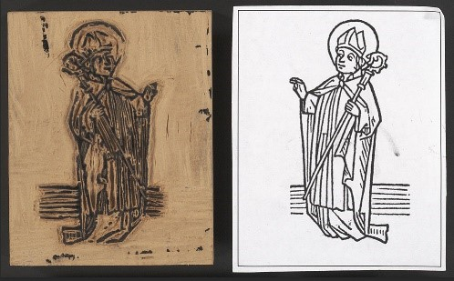

# Woodcut

## Tips on how to recognise

* Look at the surface of the print. In woodcuts, the grain of the wood is visible in the image.

* Look at the design of the print. Due to the difficulty of cutting along the grain of the wood, fine detail was very difficult to achieve so designs tend to be simplified.

* Look at the colour of the print. If printed in black and white, larger areas of white may appear to have been scooped out. If in colour, a few colours may have been reused across the image layered on top of one another.  

### Dating 








Asia from 13th CE; Europe and US 15th CE, late 19th and 20th CE

### Common subjects and themes for prints at Wellcome 

Pre 15th century - European religious scenes and figures

15th-17th century - European book illustrations

18th century - Japanese edo period prints

